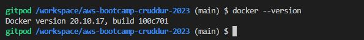
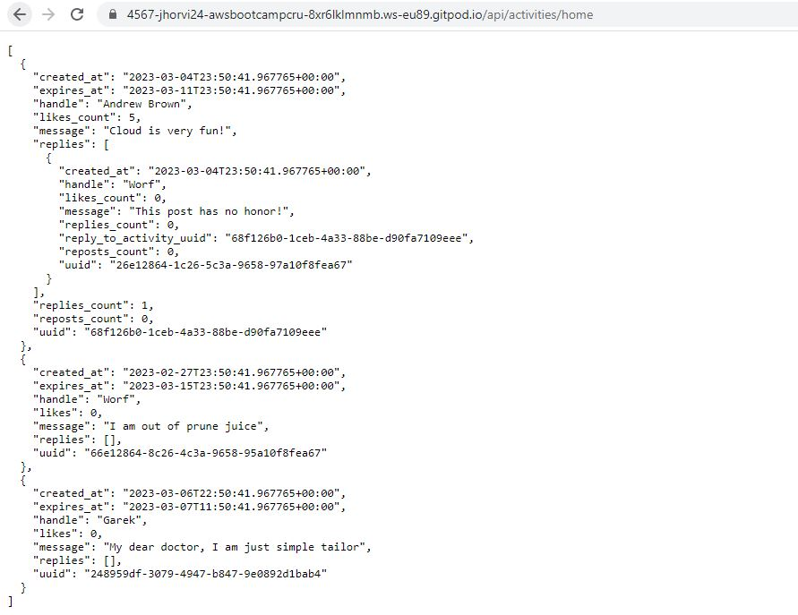
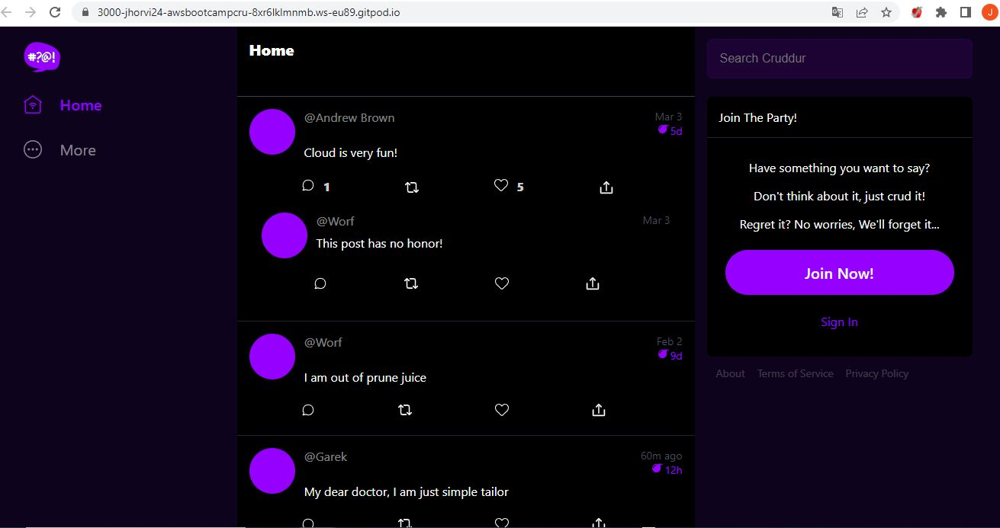
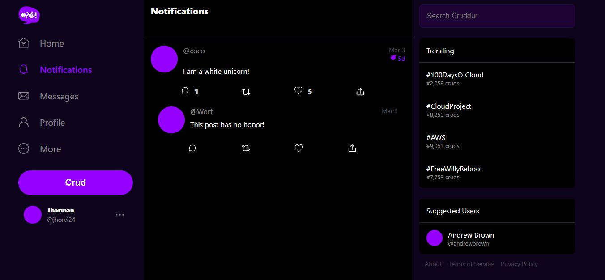

# Week 1 — App Containerization

## Docker Backend

I check if docker is installed in Gitpod using the command ```docker --version```



Inside the backend-flask directory I created a file named DockerFile with the next lines:

```sh
FROM python:3.10-slim-buster

# make a new folder Inside Container
WORKDIR /backend-flask 

#Outside Container -> Inside Container
#This contains the libraries want to install to run the app
COPY requirements.txt requirements.txt

#Inside Container
RUN pip3 install -r requirements.txt

#Outside Container -> Inside Container
# . mean everything in the current directory
# first period . /backend-flask (outside the container)
# second period . /backend-flask (inside the container)

COPY . .

#Set environment variables
ENV FLASK_ENV=development

EXPOSE ${PORT}

#CMD (command)
#python3 -m flask run --host=0.0.0.0 --port=4567
CMD [ "python3", "-m" , "flask", "run", "--host=0.0.0.0", "--port=4567"]
```

I install some libraries for python using the requirements.txt file. Before I run the application I need to configure the ENV VARS (environment variables) inside the backend-flask directory: 
```
    export FRONTEND_URL="*"
    export BACKEND_URL="*"
```


I build the docker with the next command: 
```
docker build -t  backend-flask ./backend-flask
```
And run the docker with the next command:

```
docker run --rm -p 4567:4567 -it backend-flask
```

I run the application with the next command: 

``` python3 -m flask run --host=0.0.0.0 --port=4567 ```



## Docker Frontend

Now I create other docker file but inside the frontend-react directory. Before create the docker files is necessary install nodejs package inside the frontend-react directory with the next comamand: 
```
npm i
```
After I create the docker file with the next lines:

``` 
FROM node:16.18

ENV PORT=3000

COPY . /frontend-react-js
WORKDIR /frontend-react-js
RUN npm install
EXPOSE ${PORT}
CMD ["npm", "start"]
```
I build the docker with the next command: 

```
docker build -t frontend-react-js ./frontend-react-js
```

And run the docker with the next command:
```
docker run -p 3000:3000 -d frontend-react-js
```



## Docker Compose

Finally I create a docker compose using a yml file where I can have the two container: backend docker and frontend docker. This file have the next lines:

```
version: "3.8"
services:
  backend-flask:
    environment:
      FRONTEND_URL: "https://3000-${GITPOD_WORKSPACE_ID}.${GITPOD_WORKSPACE_CLUSTER_HOST}"
      BACKEND_URL: "https://4567-${GITPOD_WORKSPACE_ID}.${GITPOD_WORKSPACE_CLUSTER_HOST}"
    build: ./backend-flask
    ports:
      - "4567:4567"
    volumes:
      - ./backend-flask:/backend-flask
  frontend-react-js:
    environment:
      REACT_APP_BACKEND_URL: "https://4567-${GITPOD_WORKSPACE_ID}.${GITPOD_WORKSPACE_CLUSTER_HOST}"
    build: ./frontend-react-js
    ports:
      - "3000:3000"
    volumes:
      - ./frontend-react-js:/frontend-react-js

# the name flag is a hack to change the default prepend folder
# name when outputting the image names
networks: 
  internal-network:
    driver: bridge
    name: cruddur
version: "3.8"
services:
  backend-flask:
    environment:
      FRONTEND_URL: "https://3000-${GITPOD_WORKSPACE_ID}.${GITPOD_WORKSPACE_CLUSTER_HOST}"
      BACKEND_URL: "https://4567-${GITPOD_WORKSPACE_ID}.${GITPOD_WORKSPACE_CLUSTER_HOST}"
    build: ./backend-flask
    ports:
      - "4567:4567"
    volumes:
      - ./backend-flask:/backend-flask
  frontend-react-js:
    environment:
      REACT_APP_BACKEND_URL: "https://4567-${GITPOD_WORKSPACE_ID}.${GITPOD_WORKSPACE_CLUSTER_HOST}"
    build: ./frontend-react-js
    ports:
      - "3000:3000"
    volumes:
      - ./frontend-react-js:/frontend-react-js

# the name flag is a hack to change the default prepend folder
# name when outputting the image names
networks: 
  internal-network:
    driver: bridge
    name: cruddur
```

## Notifications Configuration
I create the notifications parte follow the steps suplied by Andrew Brown in the next video: [Notifications Configurations](https://www.youtube.com/watch?v=k-_o0cCpksk&list=PLBfufR7vyJJ7k25byhRXJldB5AiwgNnWv&index=27)




## Add DynanoDB and Postgresql to Docker Compose

Finally I add DynamoDB and Postgresql to Docker Compose file adding the next lines
```
services:
  db:
    image: postgres:13-alpine
    restart: always
    environment:
      - POSTGRES_USER=postgres
      - POSTGRES_PASSWORD=password
    ports:
      - '5432:5432'
    volumes: 
      - db:/var/lib/postgresql/data
volumes:
  db:
    driver: local
```
